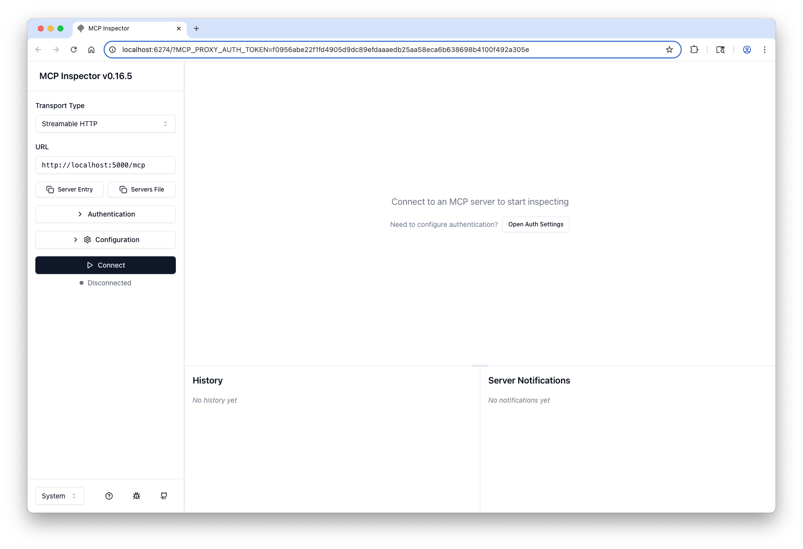

# Go Model Context Protocol Accelerator

This templates provides a Go-based accelerator for building Model Context Protocol (MCP) tools and agents. It is designed to help you quickly develop and deploy tools for LLM and agentic integration scenarios.

Special thank you to [Mark3Labs](https://github.com/mark3labs/mcp-go) for the incredible work on implementing an MCP server using Go and making this effort possible.

## Key Features

- Example MCP tool implementations in Go
- Docker support for local and cloud execution
- **Note:** All the infrastructure code (ECS cluster, Fargate service, logging, security groups, etc.) lives in the [`infra/`](infra/) folder. For deployment details, see [`infra/README.md`](infra/README.md).

## Get Started: Clone the Repository

First, clone this repository to your local machine and navigate into it:

```bash
git clone https://github.com/mmeah16/mcp-go-accelerator.git
cd mcp-go-accelerator
```

## Prerequisites

Before you begin, ensure you have the following installed on your system:

### Required:

- **Go 1.18+** - Required for running the MCP server
  - Check with: `go version`
  - Download from: [go.dev](https://go.dev/dl/)
- **Node.js (v18+)** - Required for MCP Inspector (the testing tool)
  - Check with: `node --version`
  - Download from: [nodejs.org](https://nodejs.org/)

## Quick Start

See the syntax below for steps 1-3.

1. **Create your tools** by editing `pkg/tools/tool.go`

2. **Define handlers** by editing `internal/handlers/handler.go`

3. **Register tools** by editing `pkg/tools/registry.go`

4. **Start the server:**
   ```bash
   make server
   ```

## Test Tools Using MCP Inspector

1. **Start the inspector:**

   ```bash
   make inspector
   ```

   This will automatically open the inspector in the browser.

1. **Configure Transport Type:**

- Once connected, you'll see an option to change Transport Type - select **Streamable HTTP**
- The URL will be **http://localhost:8080/mcp** (or which port was defined on `cmd/server/main.go`)
- Click **Connect**
  

2. **Navigate to Tools**

- Once connected, you'll see navigation options
- Click on the **"Tools"** tab or section

3. **View Available Tools**

- All your custom tools from `pkg/tools/registry.go` will be listed
- You'll see the built-in example tools:
  - `hello_world` - Simple hello world tool
- Any new tools you create will appear here automatically

4. **Execute a Tool**

- Click on any tool name to select it
- Fill in the required parameters (if any)
- Click **"Run"** or **"Execute"** button
- View the results in real-time
- Check the server logs for detailed execution information

## Project Structure

```bash
├── cmd/
│ └── server/
│   └── main.go # MCP tool server entry point
│ └── cli/
│   └── main.go # MCP CLI tools entry point
├── internal/
│ └── handlers/
│   └── handler.go # Define HTTP handlers with custom business logic for MCP tools
├── pkg/
│ └── cli/
│   ├── root.go # Initialize CLI tools entry point
│   └── calculator.go # Define calulcator CLI tool
│ └── logging/
│   ├── logger.go # Define logging
│ └── tools/
│   ├── registry.go # Define MCP tool registry
│   └── tools.go # Define core MCP tool logic
├── Dockerfile # Containerization support
├── Makefile # Define make commands
├── go.mod, go.sum # Go module files
├── README.md
└── ...
```

## Example Tools

The repository includes two example tools:

1. `hello_world` - A simple greeting tool
2. `calculator` - A simple calculator to perform basic arithmetic

## Key Patterns to Follow

Define the tool including it's name, description, and parameters with `pkg/tools/tool.go`.

```go
func NewHelloWorldTool() mcp.Tool {
    // Define a simple hello world tool
    tool := mcp.NewTool("hello_world",
        mcp.WithDescription("Say hello to someone"),
        mcp.WithString("name",
            mcp.Required(),
            mcp.Description("Name of the person to greet"),
        ),
    )
	return tool
}
```

Define the handler to define the tool's logic with `internal/handlers/handler.go`.

```go
func HelloHandler(ctx context.Context, request mcp.CallToolRequest) (*mcp.CallToolResult, error) {
    arguments := request.GetArguments()
    name, ok := arguments["name"].(string)
    if !ok {
        return &mcp.CallToolResult{
            Content: []mcp.Content{
                mcp.TextContent{
                    Type: "text",
                    Text: "Error: name parameter is required and must be a string",
                },
            },
            IsError: true,
        }, nil
    }

    return &mcp.CallToolResult{
        Content: []mcp.Content{
            mcp.TextContent{
                Type: "text",
                Text: fmt.Sprintf("Hello to MCP tool, %s!", name),
            },
        },
    }, nil
}
```

Register the tool in the Tool Registry with `pkg/tools/registry.go`.

```go
// Define Tools in Registry
var ToolRegistry = map[string]ToolDefinition {
	"hello_world": {
		Tool: NewHelloWorldTool(),
		Handler: handlers.HelloHandler,
	},
	"calculator": {
		Tool: NewCalculatorTool(),
		Handler: handlers.CalculatorHandler,
	},
}
```

## Using Structured Tool Handlers

An effective way to handle complex tools with structured inputs and outputs is to use Go structs to define input and output schemas. This reduces boilerplate code and the hassle of manually defining parameters.

Define the response input including with `internal/models/user.go`.

```go
type UserInput struct {
	FirstName string `json:"first_name"`
	LastName  string `json:"last_name"`
	Age       int    `json:"age"`
}

type UserResponse struct {
	ID        string `json:"id"`
	CreatedAt time.Time `json:"created_at"`
}
```

Define the tool with `pkg/tools/tool.go` - this time the `WithInputSchema` function enables referencing the schema defined above, therefore individuals parameters do not need to be defined.

```go
func NewUserTool() mcp.Tool {
    tool := mcp.NewTool("user_tool",
        mcp.WithDescription("Create new user."),
        mcp.WithInputSchema[models.UserInput](),
    )
    return tool
}
```

The UserHandler accepts the `models.UserInput` as a parameter and it's fields can be directly accessed. A `models.UserResponse` object is defined as the output of this handler.

```go
func UserHandler(ctx context.Context, request mcp.CallToolRequest, args models.UserInput) (models.UserResponse, error) {
    return models.UserResponse{
        ID:        string(args.FirstName[0]) + "_" + args.LastName + "_" + uuid.New().String(),
        CreatedAt: time.Now(),
    }, nil
}
```

The `mcp.NewStructuredToolHandler()` function can be used for type-safe handler implementation when adding the tool to the registry.

```go
var ToolRegistry = map[string]ToolDefinition {
	"user_tool": {
		Tool: NewUserTool(),
		Handler: mcp.NewStructuredToolHandler(handlers.UserHandler),
	},
}
```

## MCP CLI

Interact with your MCP tools straight from the command line—no Inspector needed! This project uses **Cobra**, a Go library for building powerful and flexible CLIs.

1. **Build the CLI binary**

```bash
go build -o mcp-cli ./cmd/cli
```

2. **Add More CLI Tools**

Define new commands under `pkg/cli` and wire them into the `rootCmd` using the `init()` function as below.

```go
func init() {
	rootCmd.AddCommand(calculatorCmd)
}
```

3. **Run the Tools CLI Tools**

Run the server as usual, and run the CLI to list available tools as below:

```bash
./mcp-cli list-tools
```

Or to interact with the calculator:

```bash
./mcp-cli calculator 3 9 add
```
